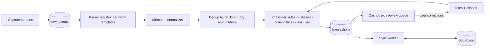

## Stack

- **UI / shared logic**: React Native + Expo (with dev-builds, since we need native modules) + TypeScript
- **Local store**: `expo-sqlite` (or WatermelonDB if we want reactive queries)
- **Sync backend**: Supabase (Postgres + Realtime + Row-level sync), free tier
- **Native modules**:
  - Android: Kotlin module for SMS BroadcastReceiver + NotificationListenerService
  - iOS: Swift Share Extension + a documented Shortcut template the user installs

## Core data model

Transactions are the unit of truth; everything else feeds into or hangs off them.

- `accounts` - cards, UPI VPAs, cash wallet, bank accounts. Flags: `isOwnAccount` (for transfer detection).
- `transactions` - `id, occurredAt, amount, currency, direction (debit/credit), accountId, counterparty, rawText, source (sms|notif|share|gmail|manual|statement), refNo, category, subcategory, confidence, status (posted|pending|reversed|settled), linkedTxnId (for refunds/transfers), needsReview`.
- `categories` - user-editable tree, seeded with the usual (Food, Transport, Shopping, Bills, Entertainment, Health, Transfers, Income, Uncategorized).
- `merchantAliases` - `rawPattern -> displayName` normalization table, seeded + user-editable.
- `rules` - `if merchant LIKE X OR refNo STARTS_WITH Y then category = Z` (user corrections become rules).
- `syncLog` - outbox for offline-first sync.

## Pipeline

Two non-negotiables here:
- **Raw events are stored before parsing**. Parser bugs never lose data; reparse when templates improve.
- **Dedup keys on bank-provided references** (UPI RRN, card auth code) when present; falls back to `(amount, accountLast4, within 2 minutes)` when not.

## Ship in 5 slices

### Slice 1: Dashboard + manual entry + local DB (cross-platform, ~2 days)
- Expo app scaffolded, SQLite schema created, basic CRUD.
- Screens: Transactions list, Add-txn form (optimized for speed: amount, account, category, done), simple monthly totals.
- Works identically on iOS and Android immediately.

### Slice 2: Android SMS + notification capture (~2-3 days)
- Native Kotlin module: BroadcastReceiver filters SMS from a configurable list of sender IDs (e.g. `*-HDFCBK`, `*-SBIUPI`), writes to `raw_events`.
- NotificationListenerService captures GPay/PhonePe/Paytm notifications (richer and more reliable than SMS for UPI).
- Template-based parser with a registry of regexes per bank. User provides sample SMSes and we tune regexes together (MVP scope = their banks only).
- Parser output goes through normalize -> dedup -> classify -> write txn.

### Slice 3: iOS capture paths (~2 days)
- **Share Extension** (Swift): long-press any SMS -> Share -> app. Feeds the same pipeline as Slice 2.
- Documented **iOS Shortcut** template: automation on "Message received from HDFC sender" -> call app URL scheme with SMS body. User installs once.
- Optional: Gmail OAuth + parse card statements / online purchase receipts (later if needed).

### Slice 4: Classifier that learns (~1-2 days)
- Rule precedence: user rule > merchant alias > MCC code > amount/time heuristic > Uncategorized.
- Every user correction writes a new rule (`if merchant contains "ZOMATO" then category = Food`).
- Confidence score drives UX: >90% auto-categorize, 60-90% show banner "Food - tap to change", <60% push to Review queue.
- Subscription detector: group recurring same-merchant / similar-amount / ~30d cadence, show dashboard card.

### Slice 5: Sync + cash wallet + reconciliation (~2 days)
- Outbox-based sync worker pushes local changes to Supabase and pulls remote updates; conflict resolution = last-write-wins per field with a corrections log.
- Cash wallet: ATM withdrawal detected -> +balance; manual cash expenses deduct.
- Monthly PDF/CSV statement import that diffs against captured transactions and flags gaps (the safety net that makes the system trustable).

## Cross-cutting decisions

- **Privacy**: all parsing happens on-device. Only parsed transactions (not raw SMS bodies) sync to Supabase. This is a deliberate choice to keep bank SMS content off any server.
- **Play Store**: since this is personal, ship as a sideloaded APK - no need to deal with SMS permission review.
- **iOS distribution**: personal dev account + TestFlight for your own devices.
- **Edge cases explicitly handled from day 1**: own-account transfers (flag, don't count), refunds (link to original), pending/reversed (status field), EMI (one primary txn + ghost monthly entries), duplicate SMS+notification (dedup by refNo).

## Files / structure we'll create

- `app/` - Expo RN app
- `app/db/schema.ts`, `app/db/migrations/` - SQLite schema
- `app/pipeline/` - `parsers/{hdfc,sbi,icici,...}.ts`, `normalize.ts`, `dedup.ts`, `classify.ts`
- `app/sync/` - outbox + Supabase client
- `android/app/src/main/java/.../SmsReceiver.kt`, `NotifListener.kt`
- `ios/ShareExtension/` - Swift share extension target
- `shortcuts/expense-capture.shortcut` - iOS Shortcut template

## Open items to pin down before coding

- Which specific banks / UPI apps / cards does your month typically include? I'll tune parsers for exactly those.
- Do you want voice entry in Slice 1 (Expo has reasonable speech-to-text) or can we skip it?
